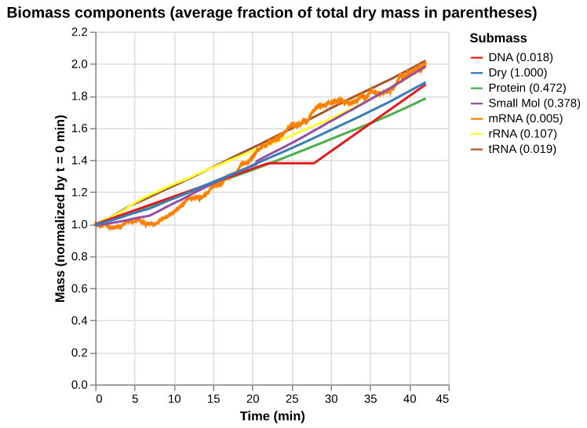
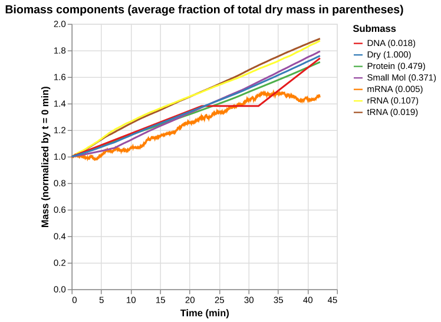
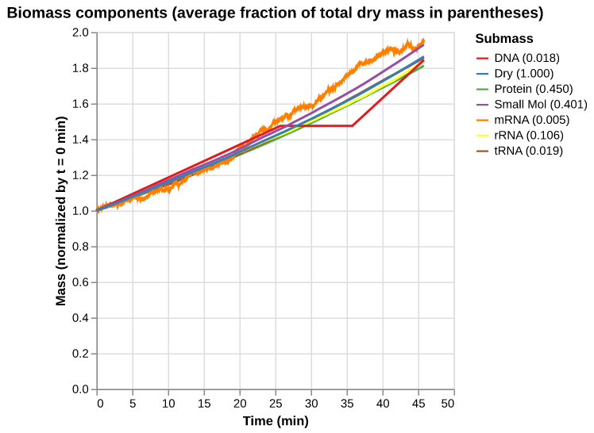
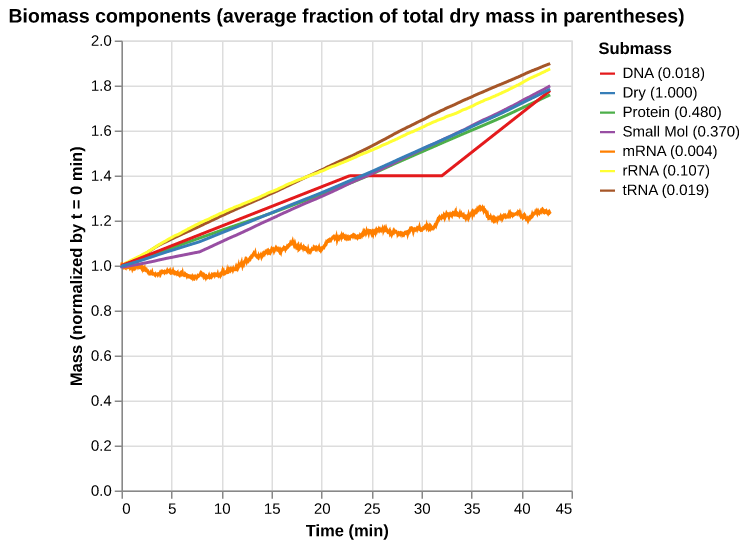
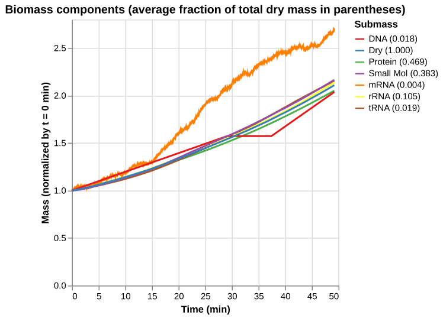
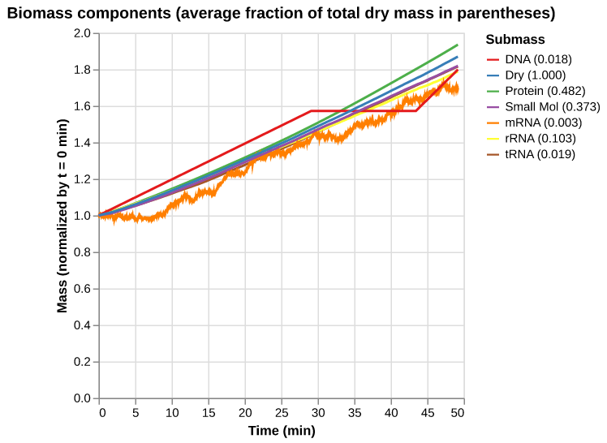
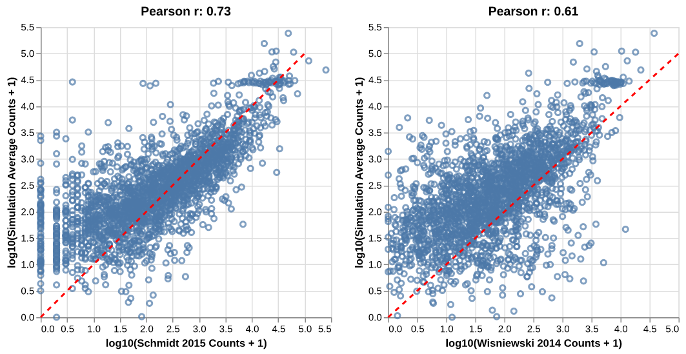

# vEcoli v1 vs v2 — two_generations comparison

_Generated from latest workflow runs by `runscripts/v1_v2_report.py`._

## Cell cycle / division times

| Seed | Gen | V1 div_time | V2 div_time | V1 cycle | V2 cycle | Δ% |
|---|---|---|---|---|---|---|
| 0 | 1 | 2530 | 2530 | 2530 | 2530 | +0.0% |
| 0 | 2 | 5507 | 5507 | 2977 | 2977 | +0.0% |
| 1 | 1 | 2573 | 2573 | 2573 | 2573 | +0.0% |
| 1 | 2 | 5527 | 5527 | 2954 | 2954 | +0.0% |

## Runtime per task (sum across instances)

| Sim | V1 wall (s) | V2 wall (s) | V1 s/tick | V2 s/tick | Δ wall % |
|---|---|---|---|---|---|
| seed 0 gen 1 | 553 | 499 | 0.219 | 0.197 | -9.8% |
| seed 0 gen 2 | 634 | 546 | 0.213 | 0.183 | -13.8% |
| seed 1 gen 1 | 563 | 510 | 0.219 | 0.198 | -9.4% |
| seed 1 gen 2 | 650 | 555 | 0.220 | 0.188 | -14.6% |
| **SIM TOTAL** | **2399** | **2110** | - | - | **-12.1%** |

## Analysis plots

### mass_fraction_summary — seed 0, gen 1

| V1 | V2 |
|---|---|
|  |  |

### mass_fraction_summary — seed 0, gen 2

| V1 | V2 |
|---|---|
|  |  |

### mass_fraction_summary — seed 1, gen 1

| V1 | V2 |
|---|---|
|  |  |

### mass_fraction_summary — seed 1, gen 2

| V1 | V2 |
|---|---|
|  |  |

### protein_counts_validation (multiseed)

| V1 | V2 |
|---|---|
|  |  |

### subgenerational_expression_table (multiseed)

**V1** ([full file](_static/v1_v2_report_assets/subgenerational_expression_table_v1.tsv))

| p_expressed | max_monomer_counts | max_mRNA_counts | cistron_idx | gene_name | cistron_name | protein_name |
|---|---|---|---|---|---|---|
| 0.25 | 752 | 1 | 6 | EG10007 | EG10007_RNA | HISM-MONOMER |
| 0.25 | 32 | 1 | 12 | EG10015 | EG10015_RNA | EG10015-MONOMER |
| 0.75 | 553 | 1 | 14 | EG10017 | EG10017_RNA | OPPSYN-MONOMER |
| 0.25 | 702 | 1 | 24 | EG10028 | EG10028_RNA | PFLACTENZ-MONOMER |
| 0.75 | 8492 | 2 | 25 | EG10029 | EG10029_RNA | PD00230 |
| 0.25 | 177 | 1 | 28 | EG10032 | EG10032_RNA | ADENYL-KIN-MONOMER |
| 0.5 | 27 | 1 | 31 | EG10035 | EG10035_RNA | LACTALDDEHYDROG-MONOMER |
| 0.25 | 1524 | 1 | 32 | EG10036 | EG10036_RNA | ALDHDEHYDROG-MONOMER |
| 0.25 | 58 | 1 | 34 | EG10039 | EG10039_RNA | AMP-NUCLEOSID-MONOMER |
| 0.75 | 23 | 2 | 41 | EG10046 | EG10046_RNA | ANSB-MONOMER |

_… 1,240 more rows_

**V2** ([full file](_static/v1_v2_report_assets/subgenerational_expression_table_v2.tsv))

| p_expressed | max_monomer_counts | max_mRNA_counts | cistron_idx | gene_name | cistron_name | protein_name |
|---|---|---|---|---|---|---|
| 0.25 | 700 | 1 | 6 | EG10007 | EG10007_RNA | HISM-MONOMER |
| 0.75 | 165 | 2 | 8 | EG10011 | EG10011_RNA | EG10011-MONOMER |
| 0.75 | 316 | 2 | 14 | EG10017 | EG10017_RNA | OPPSYN-MONOMER |
| 0.75 | 54 | 2 | 16 | EG10020 | EG10020_RNA | CPXR-MONOMER |
| 0.25 | 637 | 1 | 24 | EG10028 | EG10028_RNA | PFLACTENZ-MONOMER |
| 0.75 | 9060 | 2 | 25 | EG10029 | EG10029_RNA | PD00230 |
| 0.5 | 177 | 1 | 28 | EG10032 | EG10032_RNA | ADENYL-KIN-MONOMER |
| 0.5 | 27 | 1 | 31 | EG10035 | EG10035_RNA | LACTALDDEHYDROG-MONOMER |
| 0.25 | 1524 | 1 | 32 | EG10036 | EG10036_RNA | ALDHDEHYDROG-MONOMER |
| 0.5 | 58 | 2 | 34 | EG10039 | EG10039_RNA | AMP-NUCLEOSID-MONOMER |

_… 1,283 more rows_

### ecocyc_table (multiseed)

**V1** ([full file](_static/v1_v2_report_assets/ecocyc_table_v1.tsv))

| # Column descriptions: |
|---|
| # id | Object ID, according to EcoCyc |
| # protein-count-avg | A floating point number |
| # protein-count-std | A floating point number |
| # protein-concentration-avg | A floating point number in mM units |
| # protein-concentration-std | A floating point number in mM units |
| # relative-protein-count-to-protein-rna-counts | A floating point number |
| # relative-protein-mass-to-total-protein-mass | A floating point number |
| # relative-protein-mass-to-total-cell-dry-mass | A floating point number |
| # validation-count | A floating point number |
| id | protein-count-avg | protein-count-std | protein-concentration-avg | protein-concentration-std | relative-protein-count-to-protein-rna-counts | relative-protein-mass-to-total-protein-mass | relative-protein-mass-to-total-cell-dry-mass | validation-count |

_… 4,309 more rows_

**V2** ([full file](_static/v1_v2_report_assets/ecocyc_table_v2.tsv))

| # Column descriptions: |
|---|
| # id | Object ID, according to EcoCyc |
| # protein-count-avg | A floating point number |
| # protein-count-std | A floating point number |
| # protein-concentration-avg | A floating point number in mM units |
| # protein-concentration-std | A floating point number in mM units |
| # relative-protein-count-to-protein-rna-counts | A floating point number |
| # relative-protein-mass-to-total-protein-mass | A floating point number |
| # relative-protein-mass-to-total-cell-dry-mass | A floating point number |
| # validation-count | A floating point number |
| id | protein-count-avg | protein-count-std | protein-concentration-avg | protein-concentration-std | relative-protein-count-to-protein-rna-counts | relative-protein-mass-to-total-protein-mass | relative-protein-mass-to-total-cell-dry-mass | validation-count |

_… 4,309 more rows_

